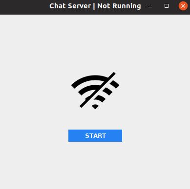
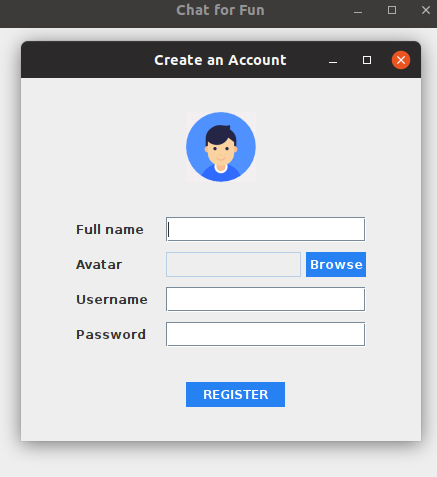
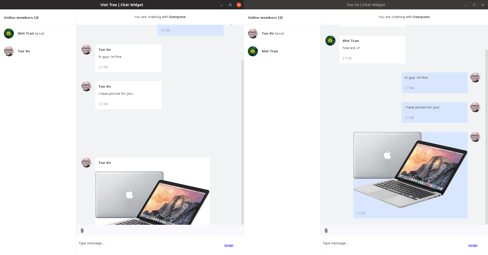

# Chat App 💬

## 1. About
- <b>Java Application</b>
- <b>Version</b>: 1.0.0
- <b>Author</b>: Vo Thai Minh Tue - 19424008 - 19HCB, HCMUS.

## 2. Requirements
- <b>Java OpenJDK 14.0.1</b>
- <b>Java Ant</b>
- <b>Eclipse IDE</b>

## 3. Quick start
### <b>Step 1</b>: Run Chat Server
- Go to folder <b>release</b>:
    + If you are using <b>Windows</b>, run file <b>chat-server.jar</b> to open the Chat Server UI.
    + If you are using <b>Linux</b>, run this below command to open the Chat Server UI:

        ```
        java -jar chat-server.jar
        ```

- Click the button <b>START</b> to run the Chat Server

    

  
### <b>Step 2</b>: Run Chat Widget
- Go to folder <b>release</b>:
    + If you are using <b>Windows</b>, run file <b>chat-server.jar</b> to open the Chat Widget UI.
    + If you are using <b>Linux</b>, run this below command to open the Chat Widget UI:

        ```
        java -jar chat-widget.jar
        ```

- Chat Widget welcome screen.

    

- If you have no an account, click the button <b>Create an Account</b> to register a chatting account.

    

- After registration, you will be navigated to Chatting Room to start chatting.

    

## 4. Build & Release
- Run this below command from <b>root folder</b> to build project:

  ```
  ant
  ```

- A folder named <b>release</b> will be created at <b>root folder</b> to store compiled classes and jar files.
    ```
    build
    |__ classes
        |__ classes
        |__ main
    |
    |__ jar
        |__ db
            |__ members.txt
        |
        |__ library
        |__ resource
            |__ avatars
            |__ icons
            |__ images
            |__ fonts
        |
        |__ upload
        |__ download
        |__ chat-server.jar
        |__ chat-widget.jar
    ```

- A folder named <b>release</b> will be created at <b>root folder</b> and available to distribute to end-user.
  ```
  release
  |__ db
    |__ members.txt
  |
  |__ library
  |__ resource
      |__ avatars
      |__ icons
      |__ images
      |__ fonts
  |
  |__ upload
  |__ download
  |__ chat-server.jar
  |__ chat-widget.jar
  ```

## 5. File Structure

```
19424008_ChatApp
|__ src
    |__ main
    |__ classes
|
|__ bin
    |__ main
    |__ classes
|
|__ db
    |__ members.txt
|
|__ library
|__ resource
    |__ avatars
    |__ icons
    |__ images
    |__ fonts
|
|__ upload
|__ download
|__ build.xml
|__ README.md

```
